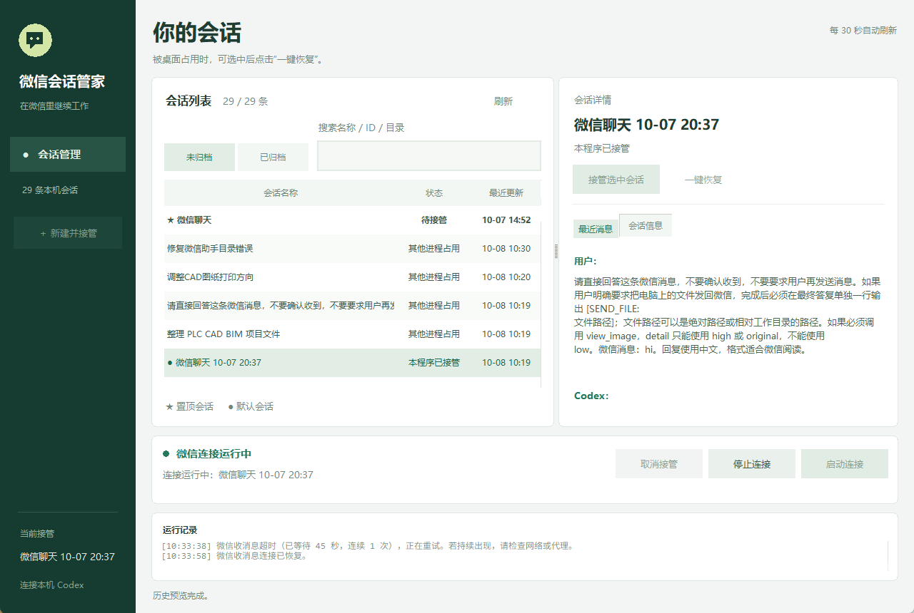
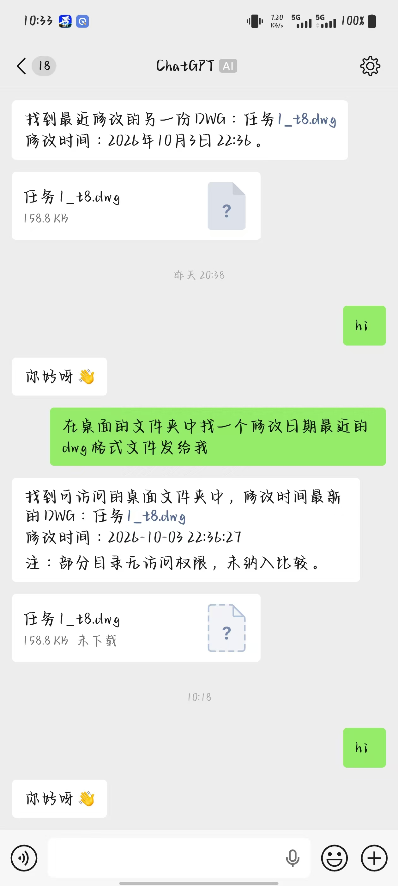
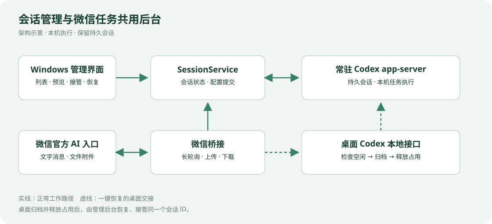

# Codex 微信会话管家

Windows 个人软件工具，通过微信官方 iLink 的 AI 聊天入口连接本机 Codex，让会话选择、任务下达和文件收发集中在一个使用流程里。

*使用者提供的实际运行窗口：选中会话显示“本程序已接管”，微信连接处于运行中；运行记录显示一次收消息超时后连接恢复。*

## 为什么做这个工具

原来的命令行助手不方便选择已有会话。会话工作目录失效或被桌面 Codex 占用时，还可能连接失败，或意外新建另一条会话，打断之前的工作上下文。

本项目围绕这些实际使用问题，增加会话列表、历史预览、接管状态和恢复流程，用于个人远程操作与本机文件回传。

## 主要功能

| 功能 | 实际行为 |
|---|---|
| 会话选择 | 搜索名称、ID、工作目录，查看置顶、默认及归档状态，预览最近文字消息 |
| 接管与新建 | 继续已有持久会话，或新建命名会话；接管失败时不静默换成新会话 |
| 连接控制 | 启动连接、停止连接、取消接管，并显示运行记录 |
| 文件收发 | 将微信附件保存到本机，也能把本机文件作为附件发回微信 |
| 截图回传 | 响应桌面截图请求并发送生成的图片 |
| 一键恢复 | 在满足条件时请求桌面端归档并释放占用，再恢复、接管同一个会话 ID |

接入的是微信带 AI 标识的官方聊天入口。任务回答与工具执行由本机 Codex 完成，程序不内置另一套 AI 模型代理。

## 微信文字交互与文件回传

*使用者提供的微信实际使用截图：顶部带 AI 标识，可以看到文字回复、寻找最近修改的 DWG 文件的请求，以及回传的 DWG 附件卡片。*

图中的“未下载”是微信附件状态；本图能展示附件到达聊天窗口，不能单凭截图确认下载后的文件完整性。这里只公开截图，不包含截图中的 DWG 文件。

## 个人工作与开发方式

本人提出使用需求、设计会话接管与恢复的操作流程，结合日常使用反馈迭代界面、按钮命名、文件回传和异常处理。代码实现、故障分析、测试与整理使用 Codex 辅助完成。

微信通信与原始 Codex 后端骨架基于开源项目 CodexPlusPlus 改造；本作品不将上游代码表述为从零独立开发。具体来源见 [NOTICE.md](NOTICE.md)。

## 值得展示的实现

*架构示意图，用于说明模块关系。*

- **共用后台**：会话管理和微信处理共用一个常驻 app-server，减少程序内部重复争用会话写入权。
- **成功后保存**：恢复并取得会话写入权之后，才保存默认会话；配置被外部修改时停止覆盖。
- **原会话恢复**：一键恢复通过桌面端释放占用，再恢复同一 ID，保留原有记录；执行前检查会话身份和是否空闲。
- **界面响应**：Tkinter 使用后台线程与事件队列处理较慢的请求；列表、消息预览和连接状态分别展示。

详细过程及实际代码节选见 [关键实现](docs/关键实现.md)。

## 验证情况

2026-10-08 本地版本已有 **39 项隔离回归测试通过记录**，包括会话配置、占用冲突、恢复失败、长轮询和桌面控制检查。专用测试会话的实际窗口操作验证了一键恢复后保留同一 ID 与持久内容，桌面 Codex 进程保持运行。

上述自动化窗口测试使用模拟微信收件箱；另有本页使用者提供的真实运行窗口与微信聊天截图，展示文字交互和 DWG 附件回传。微信图包含历史消息，未核对其全部对应的软件版本，不能替代本地新版的完整端到端回归。文件下载后完整性、PLC 和单片机完整工程尚未做专项验证。详见 [验证与限制](docs/验证与限制.md)。

## 源码与版本

[独立源码仓库：Shui-Hu/codex-wechat-session-manager](https://github.com/Shui-Hu/codex-wechat-session-manager)

本展示页对应 **2026-10-08 本地一键恢复版**。本次只整理作品集材料，没有同步独立源码仓库；源码仓库的功能与运行方法请以其对应版本说明为准。本文件夹提供展示文档和代码节选，不包含完整运行源码或 EXE。

技术栈：Python、Tkinter、Codex app-server、iLink HTTP 接口；Windows EXE 使用 PyInstaller 打包。
