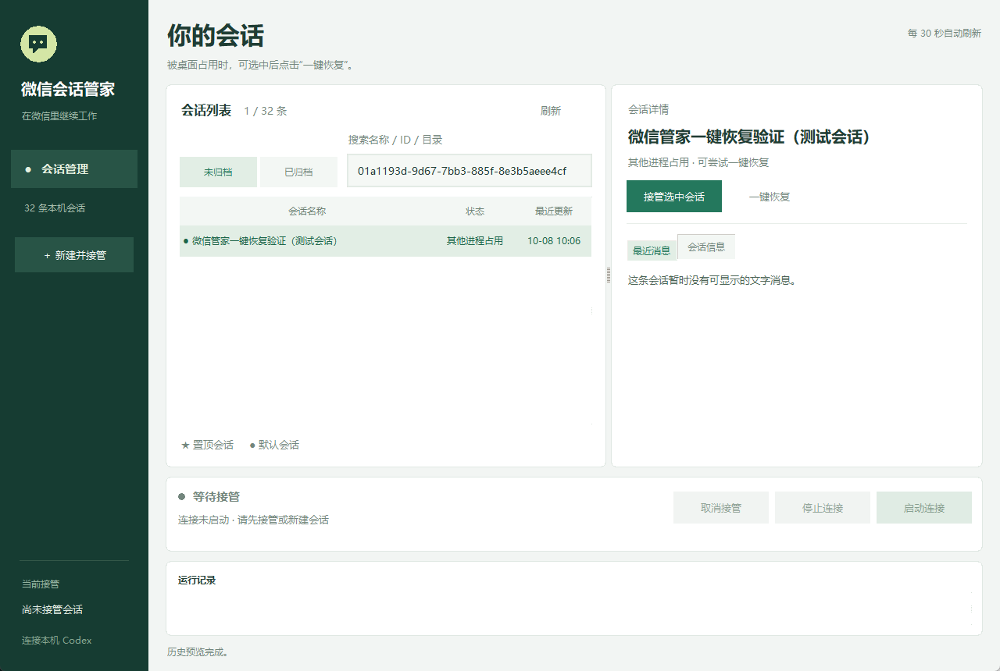

# 验证与限制

本页根据本机保存的 2026-10-08 发布验证记录整理。本次整理作品集材料没有重跑模型任务或真实微信通信，也未把模拟测试改写成线上验证。

| 验证层 | 记录与范围 |
|---|---|
| 隔离回归 | 31 项会话管理测试 + 8 项桌面控制测试，共 39 项通过 |
| 桌面实际流程 | 使用一条专用测试会话，实际窗口按钮完成自动归档、释放占用、恢复和接管 |
| 数据连续性 | 接管后仍为原会话 ID，持久测试内容保留，桌面 Codex 进程仍在运行 |
| 窗口与连接按钮 | 1280×860、1080×740 下检查控件边界；连接启停与取消接管使用模拟收件箱 |
| EXE | 一键恢复版构建完成，在隔离配置下打开窗口并正常退出 |
| HTTP 长轮询 | 既有本地模拟服务器记录：延迟 12 秒响应，在 45 秒期限内完成；不是微信线上服务器测试 |
| 实际使用截图 | 管家窗口显示接管与连接运行；微信图可见 AI 标识、文字回复和 DWG 附件卡片，其中一张卡片显示“未下载” |
| 真实文件发送 | 使用者反馈及截图支持 DWG 附件回传已发生；未验证下载后内容和哈希，未专项验证 PLC 或单片机完整工程 |

代表性测试场景：占用时保持原配置、恢复后仍为同一 ID、配置被外部修改时不覆盖、归档响应中断后确认真实状态、恢复途中再次被桌面占用、错误身份及运行中会话拒绝归档、多个可用桌面接口时停止自动操作。

可供查看的无凭据摘要：[verification-summary.json](verification-summary.json)。摘要来自本地记录，不是独立第三方认证或完整测试日志。

## 一键恢复的专用测试窗口

*此前专用测试会话的实际窗口，展示“其他进程占用”和一键恢复入口。是否恢复成功依据保存的实际流程记录，不能仅由这张操作前截图推断。*

## 新增截图证据

此次采纳使用者提供的两张原始截图，没有改写图中的聊天内容或运行状态。微信截图含多个时间段的历史消息，未逐条核对软件版本。未包含微信账号标识、登录凭据、电脑完整路径或实际工程附件。

## 使用边界

- 实际桌面恢复验证使用 Codex 桌面版本 26.1002.7124.0；未完成跨版本兼容性验证。
- 一键恢复需要桌面 Codex 可访问，并且目标会话空闲；交接期间再次打开目标会话或发送任务仍可能争用写入权。
- 当前拒绝自动归档 Codex 托管工作树会话；归档可能连带派生子会话，不能承诺仅影响一个根会话。
- 本版未重测真实微信端到端收发，也没有数小时连续运行的专项测试。
- 电脑关机、休眠、网络故障或登录凭据失效会影响服务；文件传输成功不等于文件内容可被解析。

本作品展示已实现的流程与现有证据，不将其描述为商业服务稳定性、跨版本兼容或所有工程格式的完整支持。
