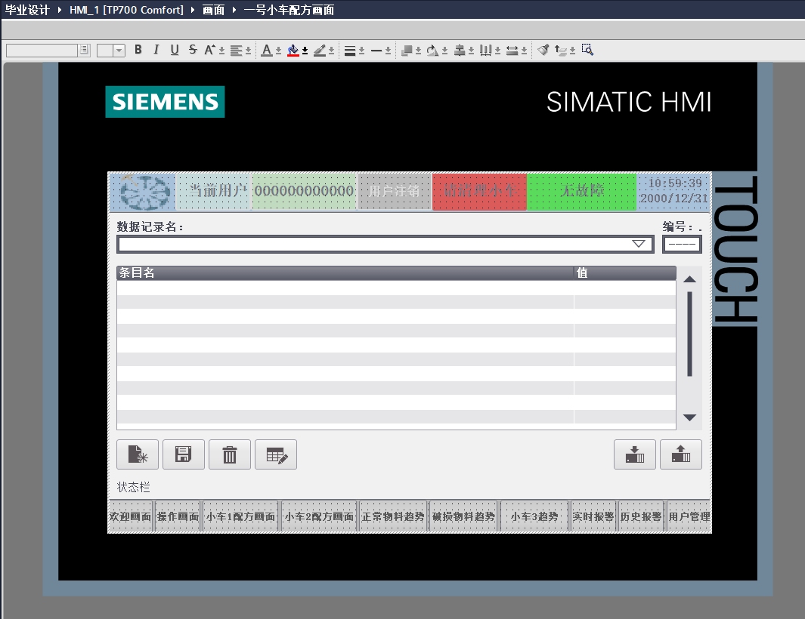
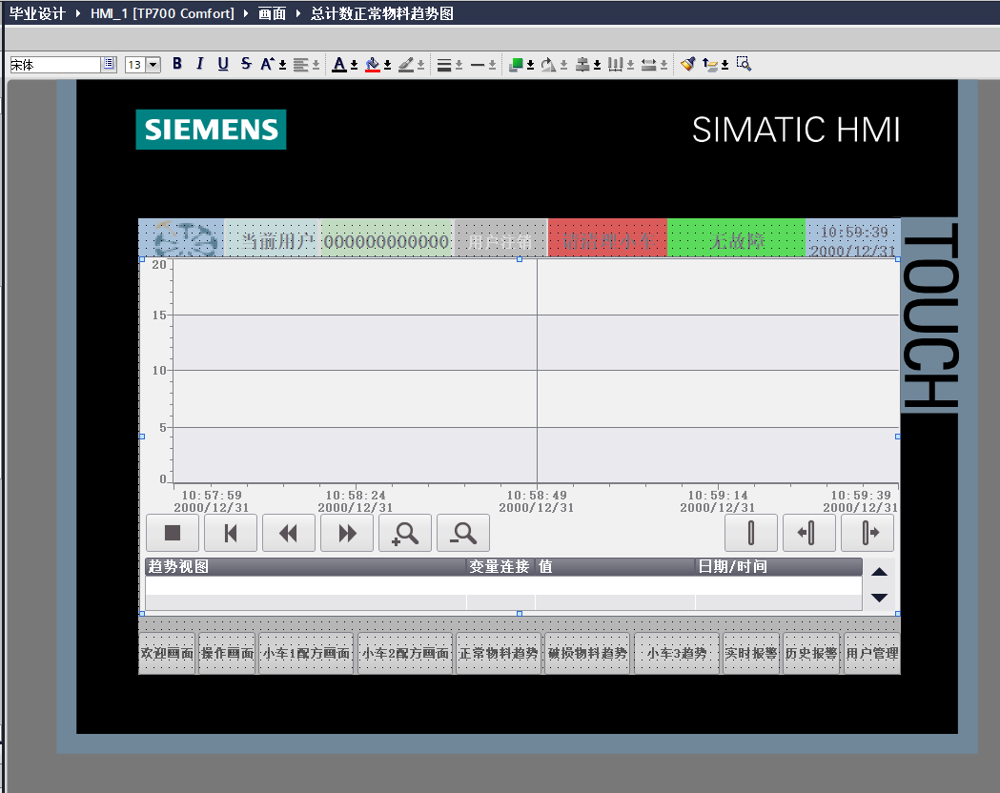

# PLC 自动化物料分拣与运输系统

本项目为毕业设计，使用 TIA Portal V18 完成物料分拣与运输系统的 PLC 程序开发、HMI 画面设计及软件仿真。系统模拟大、中、小三种规格物料的输送、正常与破损物料分流，以及三辆小车的装载和运输过程，并通过 HMI 显示运行状态、装载数量和统计数据。

本人独立完成 PLC 程序编写、HMI 画面设计及仿真调试。

## 成果预览

[查看仿真演示视频](演示视频.mp4)

操作画面截图来自 HMI 组态编辑器；实际运行效果见演示视频，其中可观察物料输送、小车移动、数量变化、配方操作及趋势显示。

## 主要功能

- **物料分拣：** 为正常和破损物料分别设置大、中、小三类处理逻辑。正常物料分流至一号或三号小车，破损物料送往二号小车。
- **人工与自动操作：** 支持人工选择物料规格和正常／破损状态；自动程序通过模拟随机数生成来料，并控制循环运行。
- **小车运输：** 配合装载数量、挡料状态和移动变量，模拟装车、运输和归位；自动模式下根据装载条件触发运输。
- **配方设置：** 一号、二号小车通过配方设置大、中、小物料的装载数量；三号小车采用固定数量条件。配方修改结合用户登录和权限管理。
- **监控与操作：** 显示各规格装载数量及正常／破损物料累计数量，提供趋势、实时／历史报警页面，以及启动、停止、复位和关机停运控制。

## 开发环境

| 项目 | 配置 |
|---|---|
| 开发软件 | TIA Portal V18 |
| PLC 项目配置 | SIMATIC S7-1200，CPU 1214C DC/DC/DC |
| HMI 项目配置 | TP700 Comfort |
| 仿真环境 | S7-PLCSIM、SIMATIC WinCC Runtime Advanced |
| 项目形式 | 毕业设计，以软件仿真为主 |

## 控制程序设计

PLC 程序按物料分拣、小车运输、活塞控制、自动来料和停机复位等功能划分程序块，由主程序统一调用。物料流程使用程序步数和位置计数推进，通过时钟位与上升沿检测更新输送位置和装载数量，并将相关变量关联到 HMI 动画及数值显示。

以下为核心梯形图截图，点击可查看完整图片：

| 程序 | 展示内容 |
|---|---|
| [主程序](images/主程序.png) | 各功能块调用、报警条件汇总及停机复位入口 |
| [大物件程序](images/大物件程序.png) | 正常物料的分阶段输送、分流和装车计数 |
| [破损大物件程序](images/破损大物件程序.png) | 破损通道分拣、二号小车装载及模拟随机数逻辑 |
| [自动物料程序](images/自动物料程序.png) | 自动模式切换、模拟来料和小车自动运输条件 |
| [一号小车程序](images/一号小车程序.png) | 堆积提示、运输、归位和装载数量清零 |

## 配方与趋势画面

### 小车配方

通过配方管理画面选择运输方案，设置不同规格物料的装载数量，并与 PLC 数据块中的参数关联。

### 数量趋势

为正常物料、破损物料及三号小车装载数量配置趋势显示，用于观察分拣和装车过程中的数据变化。

以上两张截图展示 HMI 组态布局，运行时的数据和曲线可结合演示视频查看。

## 数据与变量组织

使用数据块保存程序步数、配方参数、画面控制和上升沿检测记忆等数据，结合 PLC 变量管理物料状态、小车位置、装载计数及运行控制。

PLC 变量表：[第 1 张](PLC变量表1.png) · [第 2 张](PLC变量表2.png) · [第 3 张](PLC变量表3.png) · [第 4 张](PLC变量表4.png)

## 项目收获

通过本项目完成了从功能拆分、梯形图编写、数据组织到 HMI 组态和仿真调试的实践，重点练习顺序控制、多通道分流、小车运输联动、配方参数传递及运行数据可视化。

本页面展示软件仿真成果。
