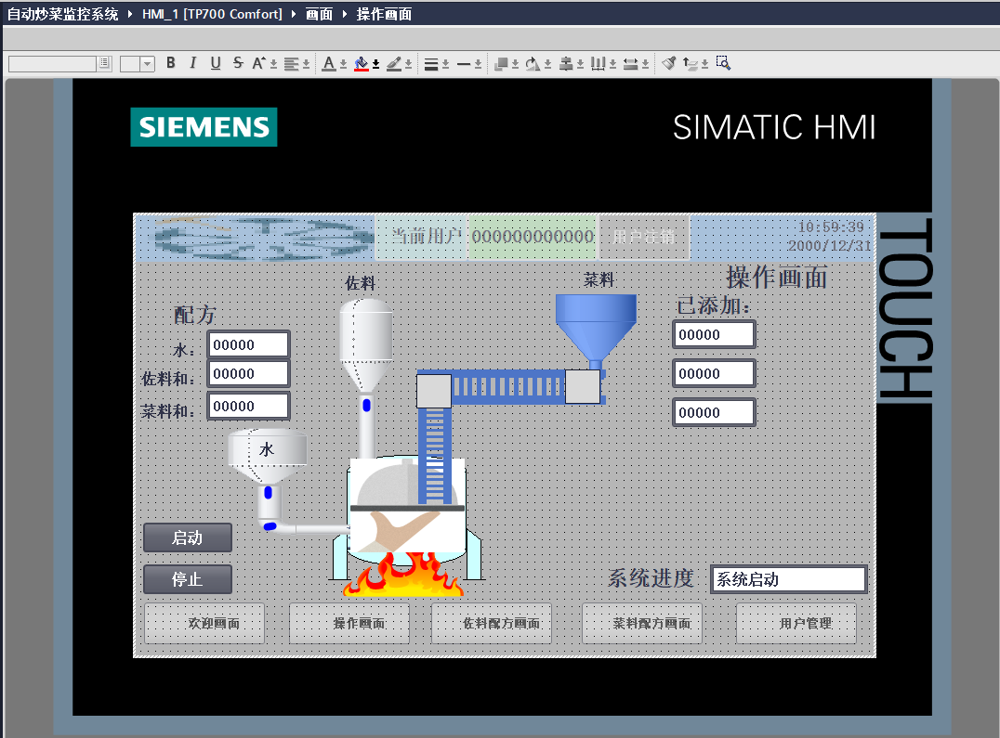
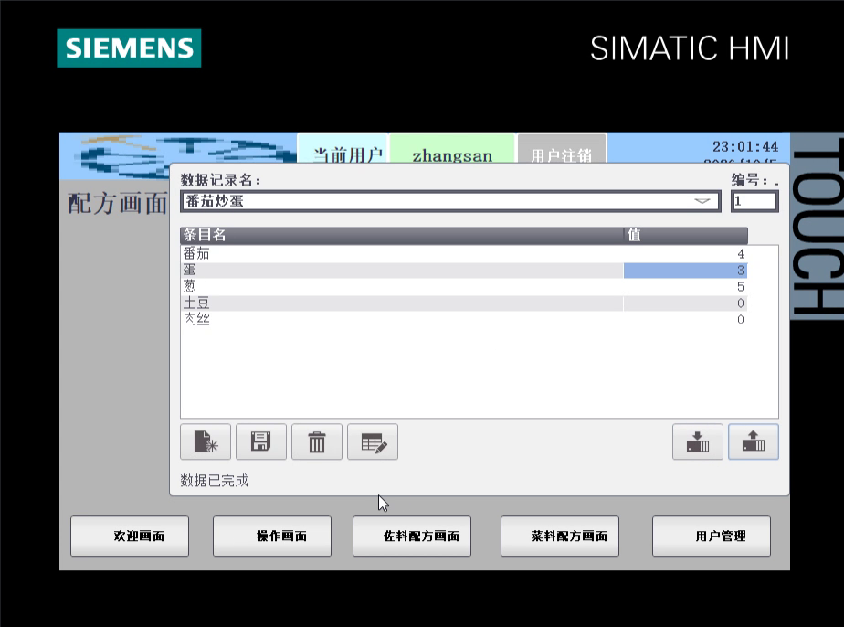
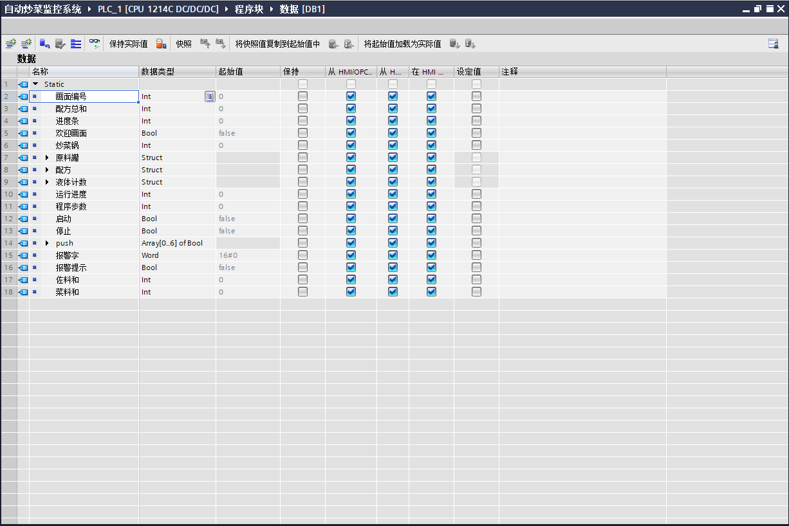
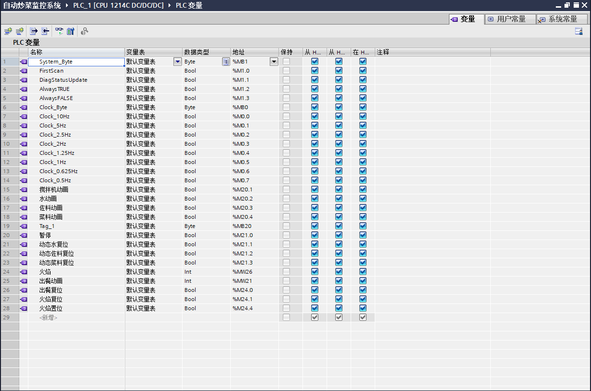

# PLC 自动炒菜控制与监控仿真项目

本项目为学校 PLC 课程设计，使用 TIA Portal V18 完成 PLC 程序开发、HMI 画面设计及软件仿真。以自动炒菜过程为对象，通过配方设置和分阶段控制，展示加水、佐料投放、菜料输送、搅拌及加工完成提示等功能。

本人独立完成 PLC 程序、HMI 画面和仿真调试。

## 运行效果

[查看仿真演示视频](演示视频.mp4)

视频展示了配方选择、按阶段添加原料、搅拌和加热状态动画，以及加工完成后的取料提示。操作画面展示 HMI 界面设计，视频展示实际仿真过程。

## 主要功能

- **配方管理：** 设置佐料和菜料两类配方，支持配方选择与参数修改；操作画面显示水量、佐料总量和菜料总量。
- **顺序控制：** 启动后依次执行加水、添加佐料、搅拌、添加菜料及后续搅拌等阶段，完成后显示“完成加工，请取料”。
- **过程可视化：** 通过管道流动、菜料输送、搅拌、火焰和取料动画配合运行进度文字，呈现仿真状态。
- **投料数量显示：** 显示水、佐料和菜料的已添加数值，便于观察配方参数与投料进度。

HMI 还提供欢迎画面及用户管理等页面入口，作品展示以配方和炒菜流程为主。

## 配方画面

佐料配方中包含盐、味精、油、白糖和水等条目；菜料配方中包含番茄、蛋、葱、土豆和肉丝等条目。不同配方记录用于展示不同菜品的参数组合。

## 开发环境

| 项目 | 配置 |
|---|---|
| 开发软件 | TIA Portal V18 |
| PLC 项目配置 | S7-1200，CPU 1214C DC/DC/DC |
| HMI 项目配置 | TP700 Comfort |
| 画面运行 | SIMATIC WinCC Runtime Advanced |
| 项目形式 | 学校课程设计，以软件仿真为主 |

## 数据与变量组织

通过数据块组织配方、炒菜锅状态、原料数据、运行进度和启动／停止等变量，并与 HMI 画面关联。动画及复位等状态通过相应变量管理，用于配合各阶段的画面显示。

### 数据块

### 动画与状态变量

## 项目收获

通过本项目练习了 PLC 顺序控制、配方数据组织、PLC 与 HMI 变量关联，以及输送、搅拌和加工过程动画的设计与仿真调试。

本页面展示软件仿真成果。
