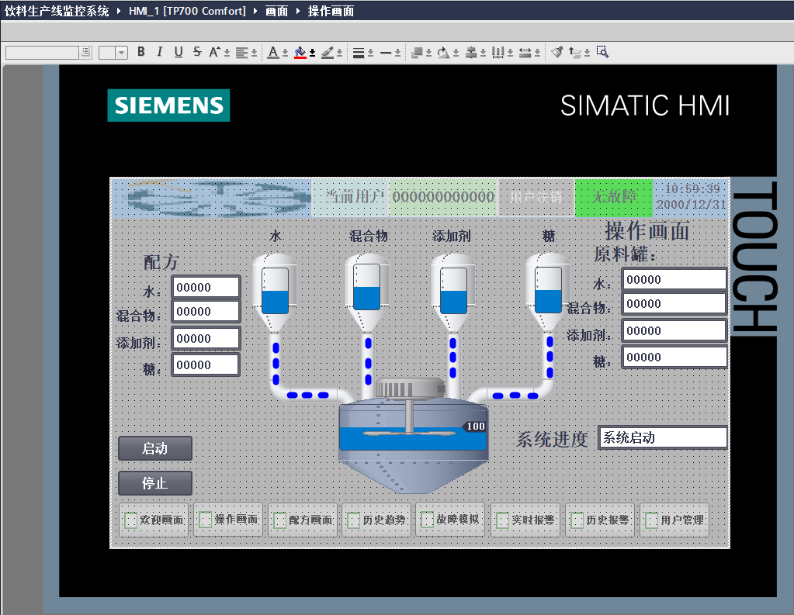
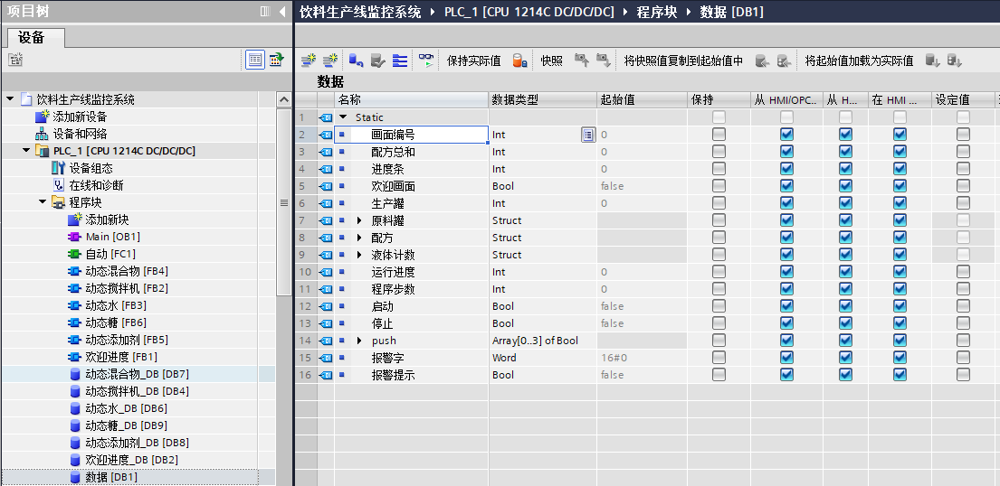
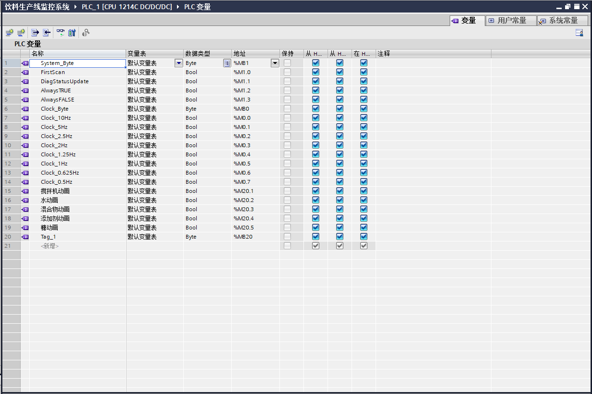

# PLC 饮料生产监控与配料仿真项目

本项目为学校 PLC 课程设计，使用 TIA Portal V18 完成 PLC 程序开发、HMI 画面设计及软件仿真。以饮料配料和搅拌过程为对象，通过人机界面设置配方，展示原料加入、生产罐状态及运行进度的变化。

本人独立完成 PLC 程序、HMI 画面和仿真调试。

## 运行效果

[查看仿真演示视频](演示视频.mp4)

视频展示了配方选择、原料依次加入、搅拌动画和历史趋势查看。操作画面展示 HMI 界面设计，视频展示实际仿真过程。

## 主要功能

- **配方设置与选择：** 通过 HMI 配方页面设置水、混合物、添加剂和糖的配料参数。
- **配料顺序控制：** 启动后按阶段加入各类原料，更新原料罐余量和生产罐显示值。
- **过程可视化：** 用管道流动、罐内液位和搅拌动画配合运行进度文字，呈现当前阶段。
- **趋势查看：** 通过历史趋势画面查看相关变量的变化。

HMI 还配置了用户相关操作、故障模拟及实时／历史报警等页面入口，作品展示以配料与搅拌过程为主。

## 开发环境

| 项目 | 配置 |
|---|---|
| 开发软件 | TIA Portal V18 |
| PLC 项目配置 | S7-1200，CPU 1214C DC/DC/DC |
| HMI 项目配置 | TP700 Comfort |
| 画面运行 | SIMATIC WinCC Runtime Advanced |
| 项目形式 | 学校课程设计，以软件仿真为主 |

## 程序与数据组织

PLC 项目按自动控制、原料动画和搅拌动画等功能划分程序块，并通过数据块组织配方、原料罐状态、运行进度及启动／停止等变量，用于与 HMI 画面交互。

### 程序块与数据块

### 动画与状态变量

## 项目收获

通过本项目练习了 PLC 分阶段控制、功能块组织、数据块与 HMI 变量关联，以及配方和动画画面的设计与仿真调试。

本页面展示软件仿真成果。
