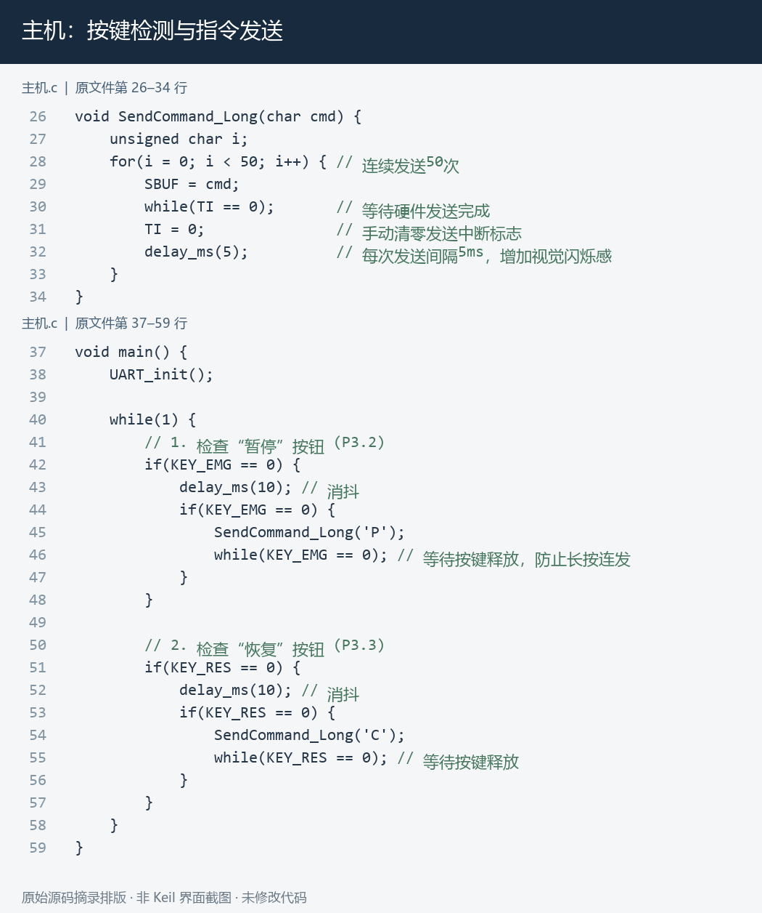
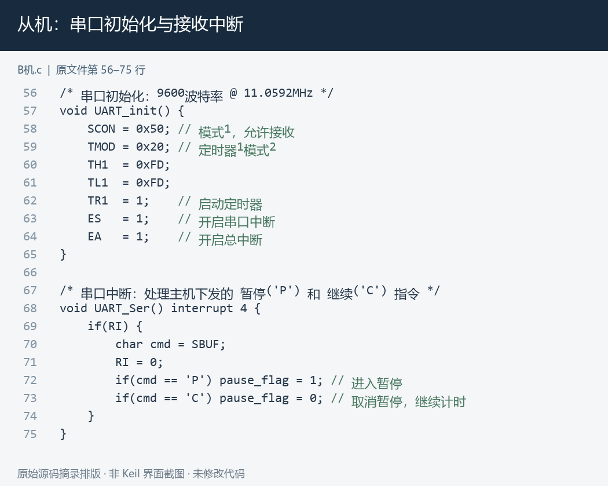
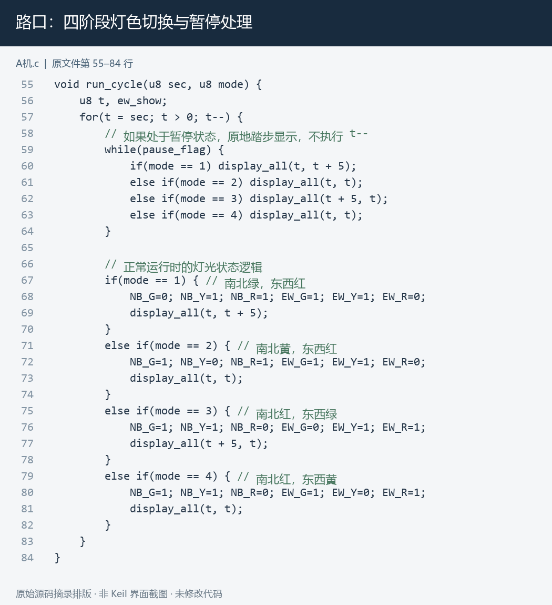
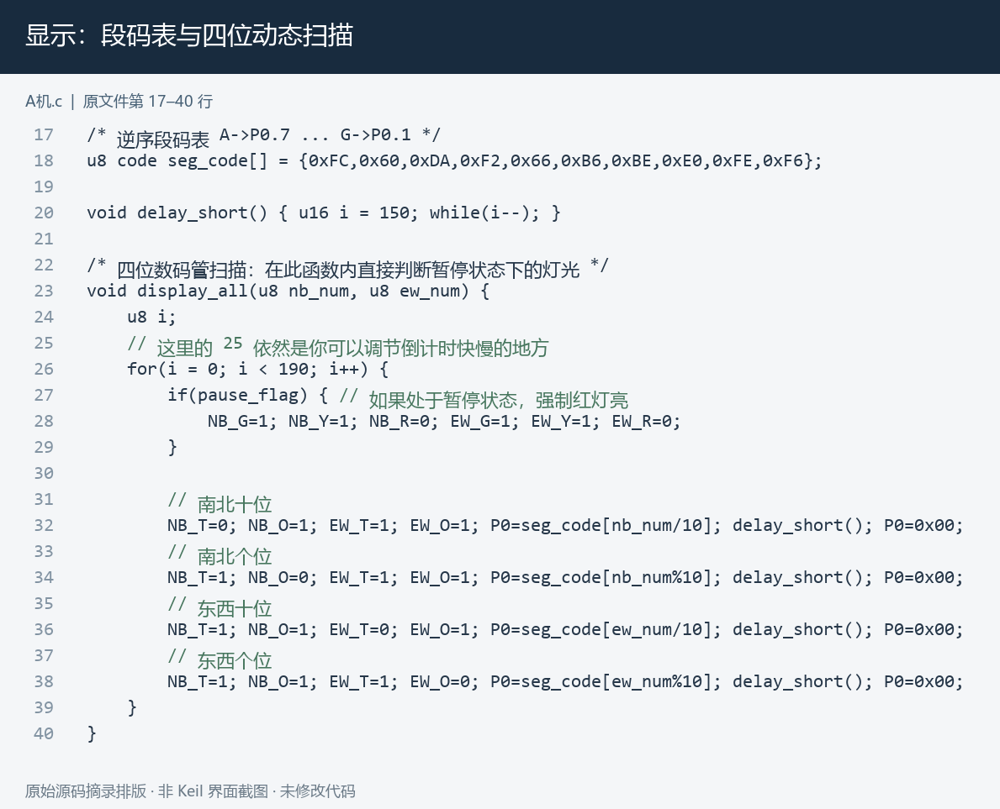
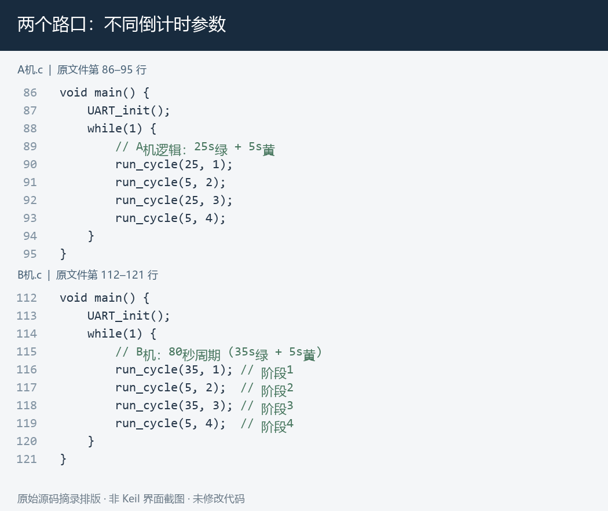

# 双十字路口红绿灯计时显示系统

基于 AT89C51 单片机设计的双十字路口红绿灯计时显示系统，使用 Keil μVision5 编写程序，并通过 Proteus 8 Professional 完成电路仿真。项目实现两个路口的交通灯切换与倒计时显示，并通过主机按键进行暂停和恢复控制。

## 个人工作

独立完成电路设计、主机及两台从机的程序编写与仿真调试，包括灯色切换逻辑、数码管显示、串口通信和按键控制。

## 系统组成

系统采用一台主机和两台从机的结构。主机负责检测控制按键并发送串口指令；A、B 两台从机分别负责两个路口的交通灯和倒计时显示，根据各自设置的参数循环运行。

## 主要功能

- **交通灯控制：** 按照预设顺序切换南北和东西方向的红、黄、绿灯。
- **倒计时显示：** 通过数码管动态扫描显示两个方向的倒计时。
- **主从通信：** 主机通过串口向从机发送控制指令。
- **暂停与恢复：** 暂停时切换为全红状态，恢复后继续正常运行。

## 开发环境

- 单片机：AT89C51。
- 程序开发：Keil μVision5 / C51。
- 电路仿真：Proteus 8 Professional。

## 核心代码展示

以下图片从项目源码中摘录排版，保留原文件行号。

### 主机按键与指令发送

### 从机串口接收

### 灯色切换与暂停控制

### 数码管动态扫描

### 两个路口的参数设置

## 项目成果

完成双路口交通灯控制系统的程序编写与 Proteus 仿真调试，展示 C51 编程、端口控制、串口中断及数码管动态显示的综合应用。展示成果为软件仿真。
